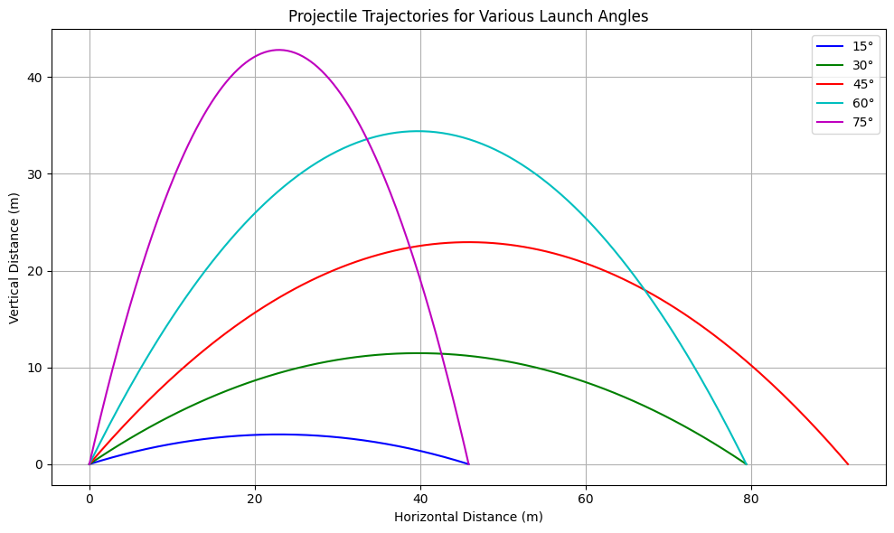
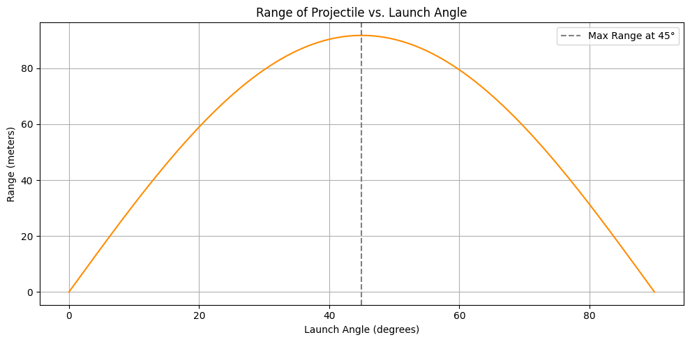

# Problem 1  
## Projectile Motion: Range vs. Angle of Projection – An In-Depth Perspective

### Introduction: The Physics Behind the Arc  
Projectile motion is a cornerstone of classical mechanics, offering a window into how forces shape the motion of objects through space. Whether launching a basketball into a hoop or sending a probe to Mars, the same physical laws apply. This discussion focuses on the trajectory of projectiles and specifically how the range is influenced by the angle of launch. By dissecting the core physics, exploring analytical methods, and considering modern computational techniques, we uncover the profound elegance behind motion through the air.

---

### 1. Theoretical Framework: Building the Mathematical Model  
We begin by applying Newton’s laws to a two-dimensional motion scenario, where the only acting force is gravity. The acceleration vector is constant and directed downward, defined as:

$$
\vec{a} = (0, -g)
$$

Solving the second-order differential equations for position and velocity, we derive:

$$
v_x(t) = v_0 \cos(\theta)
$$

$$
v_y(t) = v_0 \sin(\theta) - gt
$$

Upon integrating, we obtain the position functions:

$$
x(t) = v_0 \cos(\theta) t
$$

$$
y(t) = v_0 \sin(\theta) t - \frac{1}{2}gt^2
$$

These equations trace the parabolic path of any projectile launched with an initial speed $v_0$ at an angle $\theta$.

---

### 2. Range Optimization: A Quantitative Analysis  
The horizontal distance traveled, or **range** $R$, is derived under the condition that the projectile returns to its original height:

$$
R = \frac{v_0^2 \sin(2\theta)}{g}
$$

This result highlights several key insights:

- The range is maximized at a launch angle of $45^\circ$.
- Increasing the initial velocity has a **quadratic** effect on the range.
- The gravitational constant $g$ **inversely** affects how far the object travels.

---

### 3. Applications in the Real World: From Theory to Practice  
The principles of projectile motion extend far beyond academic examples:

- **Sports**: Analyzing the best angles for throws or kicks improves performance.
- **Defense Systems**: Trajectory calculations guide targeting and impact predictions.
- **Engineering**: Used in everything from sprinkler design to drone movement.
- **Aerospace**: Space agencies model interplanetary transfers using advanced variations of projectile theory.

---

### 4. Computational Simulations: From Ideal to Realistic  
Ideal models often ignore crucial factors. To better mimic reality, simulations incorporate:

- **Air drag**, which decelerates the projectile.
- **Altitude-dependent gravity**, especially relevant for high-altitude or space-bound motion.
- **Wind forces**, introducing asymmetry into the trajectory.
- **Digital terrain mapping**, to simulate impacts on realistic landscapes.

---

### Toward Precision: Extending the Model’s Scope  
Advanced simulations may integrate:

- **Dynamic drag coefficients** responsive to changes in velocity and air properties.
- **Rotational forces** like the Magnus effect, which alter the path of spinning objects.
- **Earth’s rotation** via the Coriolis force, critical for long-range ballistic trajectories.
- **Sophisticated numerical solvers**, such as Runge-Kutta, to handle non-linear systems.

---

### Conclusion: Uncovering the Layers of Motion  
What begins as a simple parabolic flight evolves into a complex, multifaceted problem when extended to real-world contexts. Through theory, application, and simulation, projectile motion provides a powerful framework for understanding and predicting motion in both natural and engineered systems.

### Python Simulation
```python 
import numpy as np
import matplotlib.pyplot as plt

# Constants
g = 9.81  # gravity (m/s^2)
v0 = 30   # initial velocity (m/s)
angles_deg = np.array([15, 30, 45, 60, 75])  # angles in degrees
colors = ['b', 'g', 'r', 'c', 'm']  # for plotting

# Time of flight function
def time_of_flight(v0, theta):
    return (2 * v0 * np.sin(theta)) / g

# Trajectory function
def trajectory(v0, theta, t):
    x = v0 * np.cos(theta) * t
    y = v0 * np.sin(theta) * t - 0.5 * g * t**2
    return x, y

# 1. Plot trajectories for various angles
plt.figure(figsize=(10, 6))
for angle_deg, color in zip(angles_deg, colors):
    theta = np.radians(angle_deg)
    t_flight = time_of_flight(v0, theta)
    t = np.linspace(0, t_flight, num=100)
    x, y = trajectory(v0, theta, t)
    plt.plot(x, y, label=f"{angle_deg}°", color=color)

plt.title("Projectile Trajectories at Different Launch Angles")
plt.xlabel("Horizontal Distance (m)")
plt.ylabel("Vertical Distance (m)")
plt.legend()
plt.grid(True)
plt.show()

# 2. Range vs. Angle plot
angles = np.radians(np.linspace(0, 90, 500))
ranges = (v0**2 * np.sin(2 * angles)) / g

plt.figure(figsize=(10, 5))
plt.plot(np.degrees(angles), ranges, color='darkorange')
plt.title("Range vs. Launch Angle")
plt.xlabel("Launch Angle (degrees)")
plt.ylabel("Range (m)")
plt.grid(True)
plt.axvline(45, linestyle='--', color='gray', label='Maximum Range (45°)')
plt.legend()
plt.show()
```




