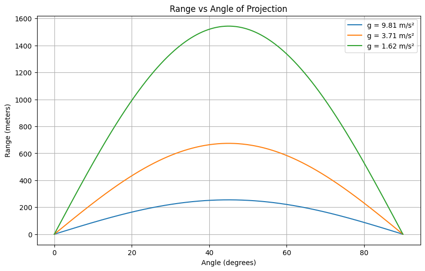
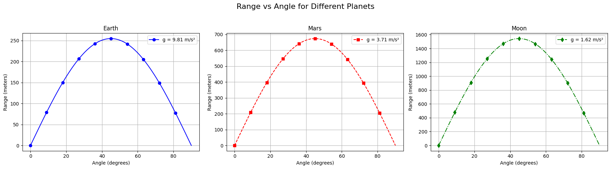

import numpy as np
import matplotlib.pyplot as plt

g = 9.81  # acceleration due to gravity (m/s^2)

def projectile_path(v0, angle_deg, g=9.81):
    theta = np.radians(angle_deg)
    t_flight = 2 * v0 * np.sin(theta) / g
    t = np.linspace(0, t_flight, 300)
    x = v0 * np.cos(theta) * t
    y = v0 * np.sin(theta) * t - 0.5 * g * t**2
    return x, y

# === Case (a): Varying initial speed at 45° ===
angles_case_a = [45]  # constant angle
speeds_case_a = [30, 40, 50]

# === Case (b): Varying angle at fixed speed of 50 m/s ===
v0_case_b = 50
angles_case_b = [15, 45, 75]

# Plotting both subfigures
fig, (ax1, ax2) = plt.subplots(2, 1, figsize=(12, 10))

# Subplot (a)
for v0 in speeds_case_a:
    x, y = projectile_path(v0, 45)
    ax1.plot(x, y, label=f'{v0} m/s')
ax1.set_title('(a) Varying Initial Speed at 45°')
ax1.set_xlabel('Horizontal Distance (m)')
ax1.set_ylabel('Vertical Distance (m)')
ax1.legend()
ax1.grid(True)
ax1.set_xlim(0, 270)
ax1.set_ylim(0, 70)

# Subplot (b)
for angle in angles_case_b:
    x, y = projectile_path(v0_case_b, angle)
    ax2.plot(x, y, label=f'{angle}°')
ax2.set_title('(b) Fixed Speed (50 m/s) at Different Angles')
ax2.set_xlabel('Horizontal Distance (m)')
ax2.set_ylabel('Vertical Distance (m)')
ax2.legend()
ax2.grid(True)
ax2.set_xlim(0, 270)
ax2.set_ylim(0, 140)

plt.tight_layout()
plt.show()

```



Colab

[My colab code](https://colab.research.google.com/drive/1vXPEEPSD0Y3ibrs5ezf4kH3yBB92C4Ow?usp=sharing)

