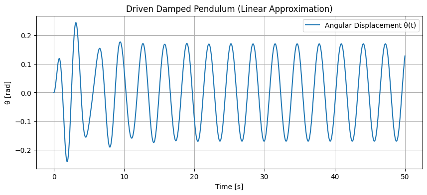
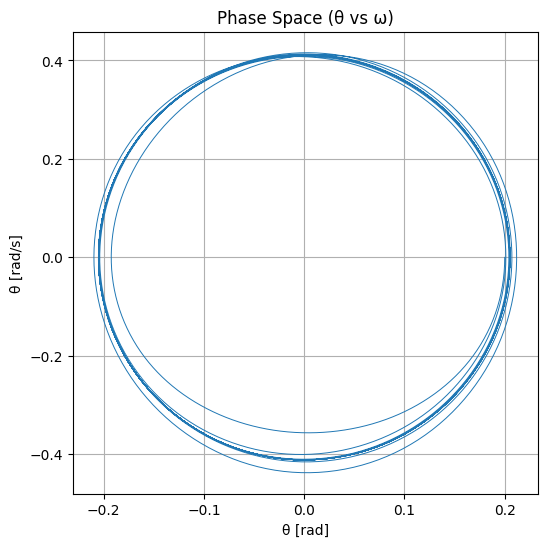
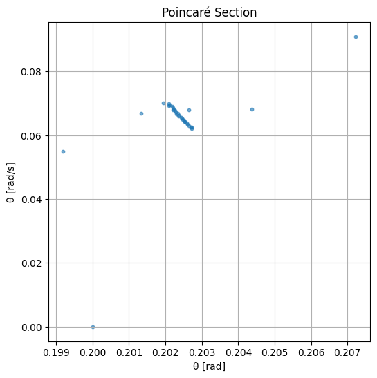

# 1. Theoretical Foundation

The motion of a forced damped pendulum is governed by the nonlinear second-order differential equation:

$$
\frac{d^2\theta}{dt^2} + b\frac{d\theta}{dt} + \frac{g}{L} \sin\theta = A\cos(\omega t)
$$

Where:

- $\theta(t)$ is the angular displacement  
- $b$ is the damping coefficient  
- $g$ is the gravitational acceleration  
- $L$ is the length of the pendulum  
- $A$ is the amplitude of the external periodic driving force  
- $\omega$ is the driving frequency

### Small-Angle Approximation

For small angles ($|\theta| \ll 1$), we use the approximation $\sin\theta \approx \theta$. The equation becomes:

$$
\frac{d^2\theta}{dt^2} + b\frac{d\theta}{dt} + \frac{g}{L} \theta = A\cos(\omega t)
$$

This is a linear nonhomogeneous ordinary differential equation, describing a driven damped harmonic oscillator. Its general solution consists of:

- A **transient component** (decays over time due to damping)
- A **steady-state oscillation** at the driving frequency

### Resonance Conditions

Resonance occurs when the driving frequency $\omega$ is close to the natural frequency of the pendulum:

$$
\omega_0 = \sqrt{\frac{g}{L}}
$$

In this case, the amplitude of steady-state oscillations is maximized. Damping reduces the resonance peak and broadens the response curve. At very high damping, resonance may be suppressed.

---

# 2. Analysis of Dynamics

### Influence of Parameters

**Damping coefficient $b$:**

- Low damping: Oscillations persist longer; resonance more pronounced.  
- High damping: Oscillations die out quickly; motion becomes sluggish.  

**Driving amplitude $A$:**

- Small $A$: Motion remains close to linear, predictable behavior.  
- Large $A$: Nonlinearity dominates; complex and chaotic dynamics emerge.  

**Driving frequency $\omega$:**

- Close to $\omega_0$: Resonance occurs.  
- Far from $\omega_0$: Forced motion with smaller amplitude.

### Transition to Chaos

When nonlinearity (due to large $\theta$) and driving are significant, the system can exhibit chaotic behavior—sensitive to initial conditions, aperiodic, and non-repeating. This transition is often studied using:

- **Phase portraits**: Plots of $\theta$ vs. $\dot{\theta}$, showing the system's trajectory in state space.  
- **Poincaré sections**: Cross-sections of the phase space at intervals of the driving period to reveal periodic or chaotic structure.  
- **Bifurcation diagrams**: Show how qualitative behavior changes as a parameter (e.g., $A$) varies.

---

# 3. Practical Applications

The forced damped pendulum serves as a model for various real-world systems:

### Mechanical Systems:

- Suspension bridges (e.g., Tacoma Narrows collapse) experience driven oscillations under wind.  
- Vibration absorbers and shock absorbers use damping principles to control motion.  

### Electrical Circuits:

- Driven RLC circuits behave identically to damped driven pendulums—capacitor voltage acts as $\theta$, inductor resistance as damping.  

### Biomechanics:

- Human gait and limb motion can resemble pendulum-like oscillations, especially under periodic driving (e.g., treadmill walking).  

### Energy Harvesting:

- Pendulum-based devices can extract energy from periodic motion, such as wave or vibration energy.

---

# 4. Implementation Overview

Simulations and visualizations reveal insights into this system’s behavior:

- **Time series** show regular, resonant, or chaotic oscillations.  
- **Phase diagrams** illustrate fixed points, limit cycles, or strange attractors.  
- **Poincaré sections** provide snapshots of system states, highlighting transitions to chaos.  
- **Bifurcation diagrams** display how solutions change as parameters like $A$ or $\omega$ are varied.

---

# Limitations and Extensions

### Limitations

- Sinusoidal forcing and linear damping may oversimplify real systems.  
- Small-angle approximation only valid for minor displacements.  
- No environmental noise or non-periodic forcing considered.  

### Potential Extensions

- **Nonlinear damping**: Model air resistance or material-specific behavior.  
- **Stochastic driving**: Incorporate noise to study robustness and real-world applicability.  
- **Coupled pendulums**: Model complex systems like clocks, power grids, or neural oscillators.  

---

This comprehensive investigation into the forced damped pendulum combines physics theory, system analysis, and real-world relevance, making it a cornerstone in the study of nonlinear and chaotic dynamics.
```







## colab
[Motivation](https://colab.research.google.com/drive/1tOsqqqLCLQMFXDHNqSEFWyfXFb0DowOj?usp=sharing)