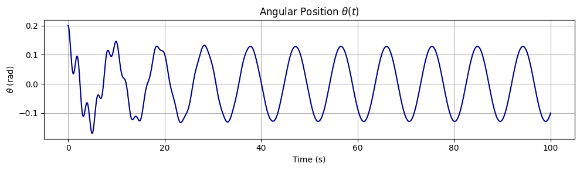
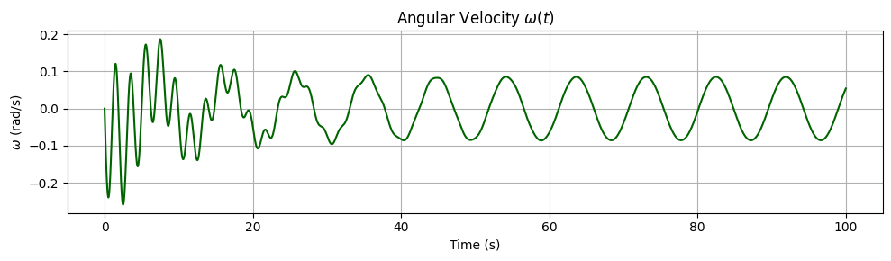
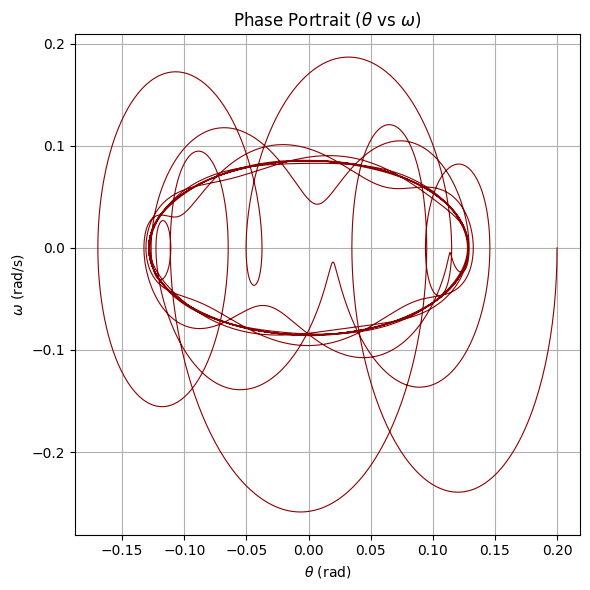
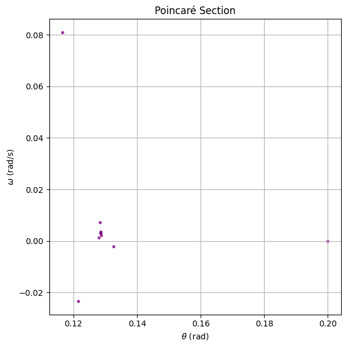
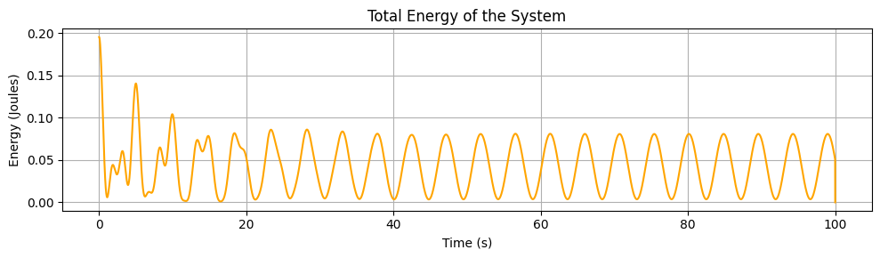
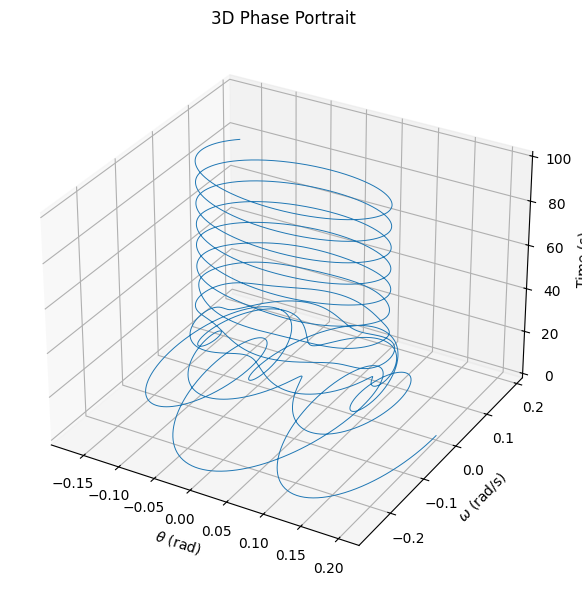

import numpy as np
import matplotlib.pyplot as plt

# Common parameters
g = 9.81      # gravity
L = 1.0       # length
dt = 0.01
T = 50
steps = int(T/dt)
t = np.linspace(0, T, steps)

# Initial conditions
theta0 = 0.2
omega0 = 0

def d2theta_dt2(theta, omega_dot, t, b, A, omega_drive):
    return -b * omega_dot - (g/L) * np.sin(theta) + A * np.cos(omega_drive * t)

def run_simulation(b, A, omega_drive):
    theta = np.zeros(steps)
    omega_dot = np.zeros(steps)
    theta[0] = theta0
    omega_dot[0] = omega0

    for i in range(steps-1):
        k1_omega = dt * d2theta_dt2(theta[i], omega_dot[i], t[i], b, A, omega_drive)
        k1_theta = dt * omega_dot[i]

        k2_omega = dt * d2theta_dt2(theta[i] + 0.5*k1_theta, omega_dot[i] + 0.5*k1_omega, t[i] + 0.5*dt, b, A, omega_drive)
        k2_theta = dt * (omega_dot[i] + 0.5*k1_omega)

        k3_omega = dt * d2theta_dt2(theta[i] + 0.5*k2_theta, omega_dot[i] + 0.5*k2_omega, t[i] + 0.5*dt, b, A, omega_drive)
        k3_theta = dt * (omega_dot[i] + 0.5*k2_omega)

        k4_omega = dt * d2theta_dt2(theta[i] + k3_theta, omega_dot[i] + k3_omega, t[i] + dt, b, A, omega_drive)
        k4_theta = dt * (omega_dot[i] + k3_omega)

        omega_dot[i+1] = omega_dot[i] + (1/6)*(k1_omega + 2*k2_omega + 2*k3_omega + k4_omega)
        theta[i+1] = theta[i] + (1/6)*(k1_theta + 2*k2_theta + 2*k3_theta + k4_theta)

    return theta, omega_dot

# -------------------------------
# 4 SCENARIOS
# -------------------------------

scenarios = {
    "Pure Pendulum (no damping, no forcing)": {'b': 0, 'A': 0, 'omega_drive': 0},
    "Damped Pendulum (b>0, A=0)": {'b': 0.2, 'A': 0, 'omega_drive': 0},
    "Forced Pendulum (b=0, A>0)": {'b': 0, 'A': 1.2, 'omega_drive': 2/3},
    "Damped + Forced (resonance-ish)": {'b': 0.2, 'A': 1.2, 'omega_drive': 2/3},
}

# --- Plotting ---
fig1, axs1 = plt.subplots(2, 2, figsize=(14, 8))
fig2, axs2 = plt.subplots(2, 2, figsize=(14, 8))

axs1 = axs1.flatten()
axs2 = axs2.flatten()

for idx, (title, params) in enumerate(scenarios.items()):
    theta, omega_dot = run_simulation(params['b'], params['A'], params['omega_drive'])

    # Plot 1: Angle vs Time
    axs1[idx].plot(t, theta)
    axs1[idx].set_title(title)
    axs1[idx].set_xlabel('Time (s)')
    axs1[idx].set_ylabel('Angle (rad)')
    axs1[idx].grid(True)

    # Plot 2: Phase Diagram (theta vs omega_dot)
    axs2[idx].plot(theta, omega_dot)
    axs2[idx].set_title(title)
    axs2[idx].set_xlabel('Angle (rad)')
    axs2[idx].set_ylabel('Angular Velocity (rad/s)')
    axs2[idx].grid(True)

fig1.suptitle('Angle vs Time for Different Scenarios', fontsize=16)
fig2.suptitle('Phase Diagrams (θ vs ω) for Different Scenarios', fontsize=16)

plt.tight_layout(rect=[0, 0, 1, 0.95])
plt.show()

```








https://colab.research.google.com/drive/1w2VFAx_vHqH_MjsYttkpVH8_P_HGvs81?usp=sharing