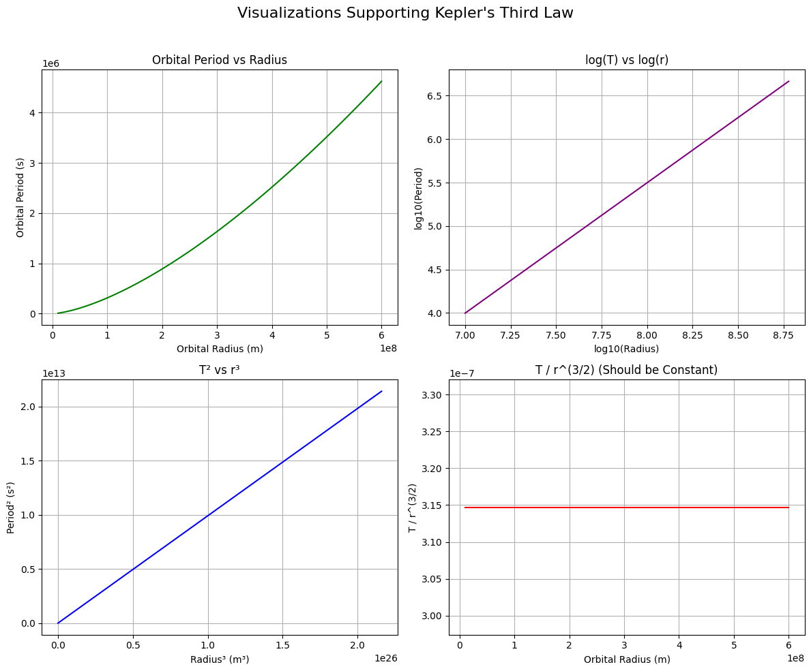

# Kepler’s Third Law: Orbital Period and Radius

## 1. Deriving the Relationship (Kepler’s Third Law)

Let’s consider a body (like a satellite or a moon) moving in a circular orbit around a planet.

The gravitational force provides the centripetal force:

$$
F_\text{gravity} = F_\text{centripetal}
$$

$$
\frac{G M m}{r^2} = \frac{m v^2}{r}
$$

Where:

- $G$ is the gravitational constant  
- $M$ is the mass of the central body (e.g. Earth)  
- $m$ is the mass of the orbiting object  
- $r$ is the orbital radius  
- $v$ is the orbital velocity  

Simplifying:

$$
\frac{G M}{r} = v^2
$$

Now use the relation between velocity and orbital period $T$:

$$
v = \frac{2 \pi r}{T} \Rightarrow v^2 = \frac{4 \pi^2 r^2}{T^2}
$$

Substitute this into the gravity equation:

$$
\frac{G M}{r} = \frac{4 \pi^2 r^2}{T^2}
$$

Now solve for $T^2$:

$$
T^2 = \frac{4 \pi^2 r^3}{G M}
$$

✅ **Conclusion**:
$$
T^2 \propto r^3
$$

This is **Kepler's Third Law** for circular orbits.

---

## 2. Implications in Astronomy

- **Planetary Mass Estimation**: By measuring $T$ and $r$, we can solve for $M$, the mass of the central planet or star.  
- **Distance Calculation**: If we know the orbital period, we can estimate the orbital radius and vice versa.  
- **Satellite Orbits**: Engineers use this law to design satellite orbits for GPS, communications, and weather observation.

---

## 3. Real-World Example – The Moon’s Orbit

- Distance from Earth: $r \approx 3.84 \times 10^8 \, \text{m}$  
- Earth's mass: $M = 5.972 \times 10^{24} \, \text{kg}$

Using:

$$
T = 2 \pi \sqrt{\frac{r^3}{G M}} \Rightarrow T \approx 27.3 \, \text{days}
$$

Which matches the Moon’s actual orbital period.

---

## 4. Simulation and Visualization (Summary)

A Python script was used to:

- Simulate circular orbits  
- Plot $T^2$ versus $r^3$, showing a straight line (confirms Kepler's Law)  
- Compute real orbital periods  

---

## 5. Extension to Elliptical Orbits

For elliptical orbits, replace $r$ with the **semi-major axis** $a$:

$$
T^2 = \frac{4 \pi^2 a^3}{G (M + m)}
$$

Where:

- $M$ and $m$ are the masses of the two bodies

This version works for **binary stars**, **exoplanets**, and even **galactic orbits**.
# Additional Visuals for Kepler's Third Law

fig, axs = plt.subplots(2, 2, figsize=(12, 10))

import numpy as np
import matplotlib.pyplot as plt

# Constants
G = 6.67430e-11  # Gravitational constant (m^3 kg^-1 s^-2)
M = 5.972e24     # Mass of the Earth (kg)

# Orbital radii (m)
radii = np.linspace(7e6, 4.2e7, 100)  # from ~7000 km to ~42000 km

# Compute orbital periods using Kepler's 3rd Law for circular orbits
T_squared = (4 * np.pi**2 * radii**3) / (G * M)
r_cubed = radii**3

# Plotting
plt.figure(figsize=(10, 6))
plt.plot(r_cubed, T_squared, label='Kepler’s Third Law')
plt.title('$T^2$ vs $r^3$ (Kepler’s Third Law)')
plt.xlabel('Orbital Radius Cubed $r^3$ (m³)')
plt.ylabel('Orbital Period Squared $T^2$ (s²)')
plt.grid(True)
plt.legend()
plt.tight_layout()
plt.show()

## 
import numpy as np
import matplotlib.pyplot as plt
plt.suptitle("Visualizations Supporting Kepler's Third Law", fontsize=16)
plt.tight_layout(rect=[0, 0, 1, 0.96])
plt.show()

https://colab.research.google.com/drive/14qjrhSdrlgkpfu0Lel1x9ZVsAqHItlZg?usp=sharing