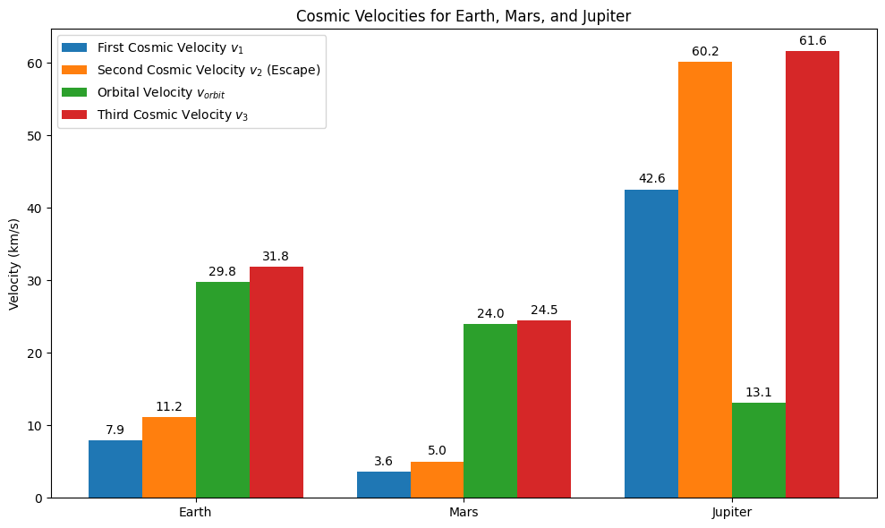
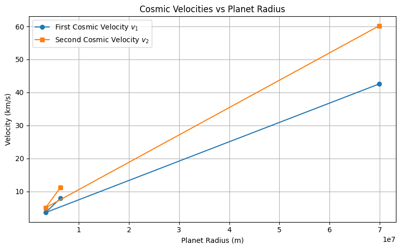
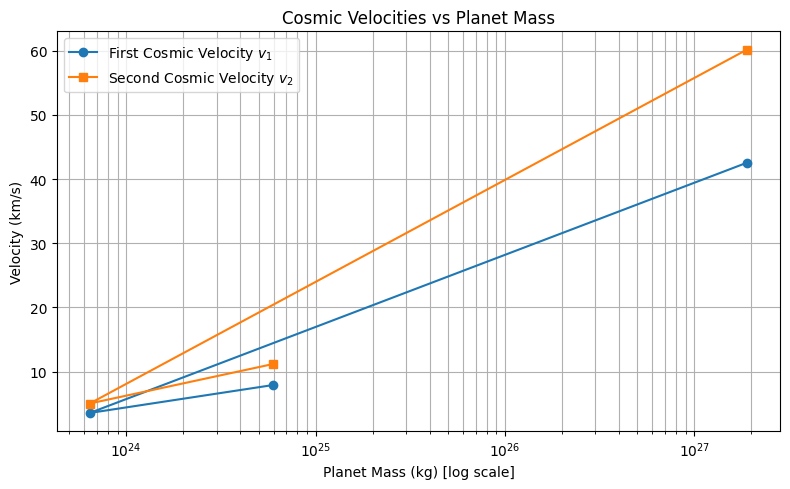
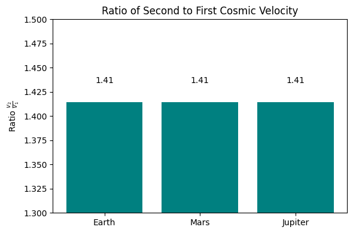
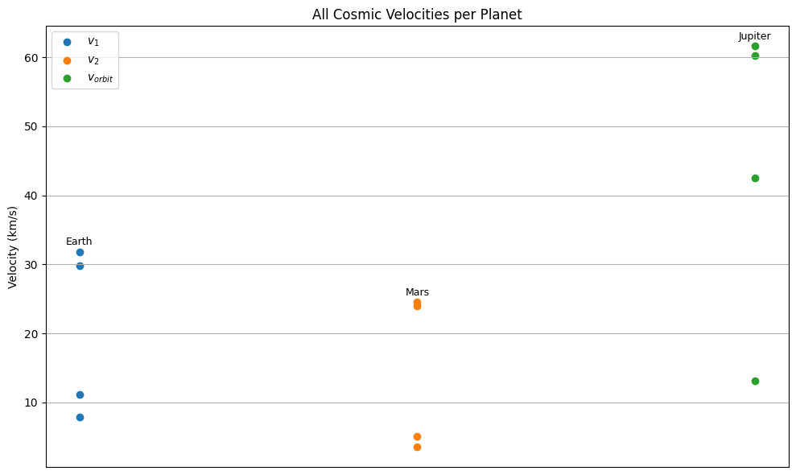
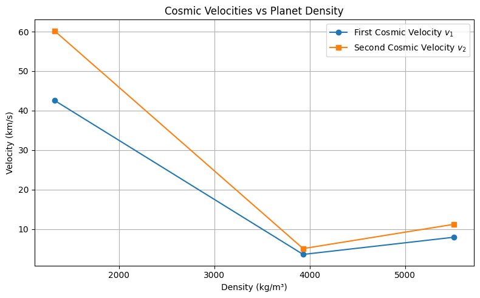

# Escape Velocities and Cosmic Velocities

## Introduction and Motivation

The concept of escape velocity is fundamental in astrophysics and aerospace engineering. It defines the minimum speed an object must reach to break free from the gravitational pull of a celestial body without any additional propulsion. Beyond escape velocity, the concepts of the first, second, and third cosmic velocities provide critical thresholds describing different kinds of motion in space—from orbiting a planet to leaving the solar system entirely.

These velocities underpin the mechanics of satellite launches, space missions, and the emerging possibilities of interplanetary and even interstellar travel. Understanding them allows us to plan missions, estimate fuel requirements, and develop propulsion systems.

## Definitions and Physical Meaning

### First Cosmic Velocity

The first cosmic velocity is the minimum horizontal velocity an object must have to maintain a stable, circular orbit just above the surface of a celestial body (e.g., a planet). At this velocity, the gravitational pull provides the exact centripetal force needed to keep the object moving in a circle.

Mathematically, the first cosmic velocity $v_1$ is given by:

$$
v_1 = \sqrt{\frac{GM}{R}}
$$

Where:

- $G = 6.67430 \times 10^{-11} \ \mathrm{m}^3\,\mathrm{kg}^{-1}\,\mathrm{s}^{-2}$ is the gravitational constant,
- $M$ is the mass of the celestial body,
- $R$ is the radius of the celestial body.

This velocity does not allow the object to rise or fall; it moves tangentially, continuously falling around the planet, creating an orbit.

### Second Cosmic Velocity

The second cosmic velocity, commonly called the escape velocity, is the minimum velocity required to leave the gravitational field of the planet completely without further acceleration.

This velocity is derived from the conservation of energy principle: the initial kinetic energy must be equal to or greater than the gravitational potential energy binding the object to the planet.

$$
v_2 = \sqrt{\frac{2GM}{R}} = \sqrt{2} \times v_1
$$

Physically, reaching this velocity means the object has enough energy to move infinitely far away from the planet, reaching zero velocity only at infinity.

### Third Cosmic Velocity

The third cosmic velocity is the speed required to escape not only the planet’s gravity but also the gravitational pull of the entire star system (e.g., the Sun in our Solar System).

When a spacecraft escapes a planet, it already inherits the orbital velocity of that planet around the star. To leave the star system, it must reach a velocity sufficient to overcome the star’s gravity, starting from the planet’s surface.

An approximate formula for the third cosmic velocity $v_3$ is:

$$
v_3 = \sqrt{v_2^2 + v_{\text{orbit}}^2}
$$

Where $v_{\text{orbit}}$ is the planet’s orbital velocity around the star.

## Mathematical Derivations and Parameters

The derivations rely on Newtonian mechanics and energy conservation principles.

- **First Cosmic Velocity**: Equalizes gravitational force to centripetal force:

$$
\frac{GMm}{R^2} = \frac{mv^2}{R} \quad \Rightarrow \quad v = \sqrt{\frac{GM}{R}}
$$

- **Second Cosmic Velocity**: Total energy zero condition (kinetic + potential):

$$
\frac{1}{2}mv^2 - \frac{GMm}{R} = 0 \quad \Rightarrow \quad v = \sqrt{\frac{2GM}{R}}
$$

- **Third Cosmic Velocity**: Combining escape velocity from planet and orbital velocity around the star, assuming velocities combine vectorially.

### Key Parameters Influencing Velocities:

- **Mass of the celestial body ($M$):** Heavier bodies exert stronger gravity; velocities increase.
- **Radius of the celestial body ($R$):** Larger radius means the gravitational pull at the surface is weaker; velocities decrease.
- **Distance from the star ($d$):** Affects the orbital velocity of the planet around the star, influencing the third cosmic velocity.

## Calculated Values for Earth, Mars, and Jupiter

Using accepted physical constants and planetary data, the velocities are approximately:

| Parameter            | Earth               | Mars                | Jupiter             |
|----------------------|---------------------|---------------------|---------------------|
| Mass $M$ (kg)        | $5.972 \times 10^{24}$ | $6.417 \times 10^{23}$ | $1.898 \times 10^{27}$ |
| Radius $R$ (m)       | $6.371 \times 10^{6}$  | $3.390 \times 10^{6}$  | $6.991 \times 10^{7}$  |
| Distance from Sun $d$ (m) | $1.496 \times 10^{11}$ | $2.279 \times 10^{11}$ | $7.785 \times 10^{11}$ |
| First Cosmic Velocity $v_1$ (km/s)  | 7.9                 | 3.5                 | 42.2                |
| Second Cosmic Velocity $v_2$ (km/s) | 11.2                | 5.0                 | 59.7                |
| Orbital Velocity $v_{\text{orbit}}$ (km/s) | 29.8                | 24.0                | 13.1                |
| Third Cosmic Velocity $v_3$ (km/s)  | 31.6                | 24.5                | 60.9                |

## Importance in Space Exploration

### Launching Satellites and Space Stations

The first cosmic velocity is fundamental to placing satellites and space stations into orbit. Achieving this speed allows satellites to continuously "fall around" Earth rather than falling back to the surface.

For Earth, this means a velocity of about 7.9 km/s near the surface.

### Interplanetary Missions

To travel from one planet to another, spacecraft must escape the planet’s gravity by reaching or exceeding the second cosmic velocity.

This velocity is roughly 11.2 km/s for Earth and significantly less for smaller bodies like Mars.

Once in space, spacecraft use additional propulsion or gravitational assists to transfer between planetary orbits.

### Interstellar Travel and Leaving the Solar System

Missions aiming to leave the entire solar system, such as the Voyager probes, require achieving velocities close to or exceeding the third cosmic velocity.

For Earth, this is about 31.6 km/s.

This velocity accounts for the escape velocity from Earth plus the orbital velocity of Earth around the Sun.

Achieving the third cosmic velocity is critical for future interstellar probes or any hypothetical manned interstellar missions.

## Summary

- The **first cosmic velocity** is the orbital speed necessary to circle a planet.
- The **second cosmic velocity** is the speed needed to leave the planet’s gravitational influence.
- The **third cosmic velocity** is the speed required to escape the gravitational pull of the entire star system starting from the planet's surface.
- These velocities depend primarily on the mass and radius of the planet, and for the third velocity, also on the planet’s orbital speed around its star.
- Understanding these velocities is crucial for designing spacecraft trajectories, determining fuel needs, and planning missions ranging from satellites to interstellar probes.
##

## colab
[Motivation](https://colab.research.google.com/drive/1Lm694Z2g4obZKouWKKqVpvfBitZwyGDv?usp=sharing)