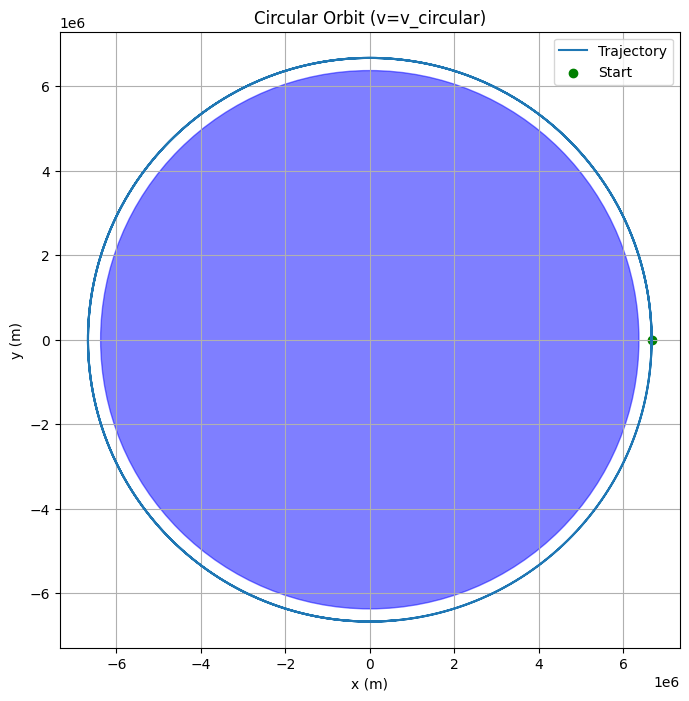
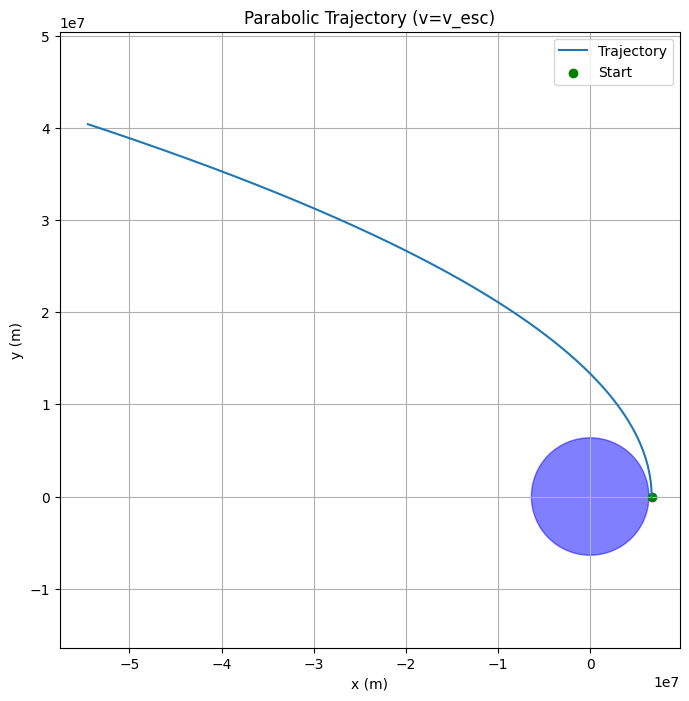
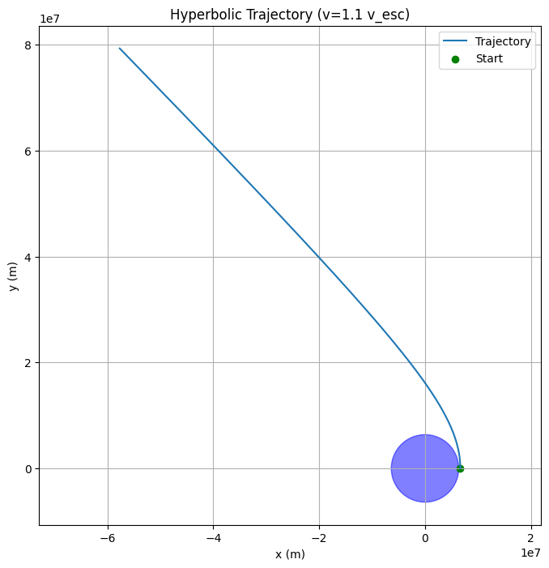
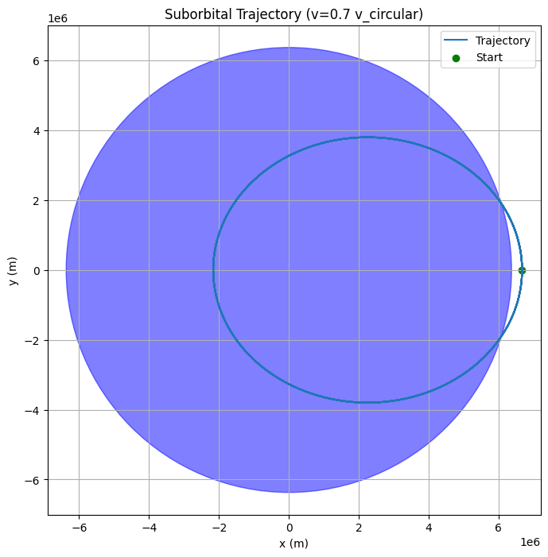

# Problem 3: Trajectories of a Freely Released Payload Near Earth

## Introduction

When a payload is released from a rocket near Earth, its subsequent path through space depends critically on its initial position, velocity, and the gravitational pull exerted by Earth. This problem sits at the intersection of classical mechanics and orbital dynamics, presenting a real-world scenario crucial for space mission planning, such as satellite deployment, payload retrieval, or spacecraft return.

Understanding the nature of these trajectories is essential for controlling payload behavior—whether to achieve stable orbit, enable safe reentry, or execute escape trajectories.

---

## 1. Fundamental Physics and Governing Principles

### Newton’s Law of Universal Gravitation

The dominant force acting on the payload is Earth’s gravitational attraction, described by:

\[
\mathbf{F} = - \frac{GMm}{r^{2}} \hat{\mathbf{r}}
\]

where

- $G$ is the gravitational constant,
- $M$ is Earth’s mass,
- $m$ is the payload’s mass,
- $r$ is the distance from Earth’s center to the payload,
- $\hat{\mathbf{r}}$ is the unit vector pointing from Earth to payload.

Since $m$ cancels out in the acceleration equation, the payload’s acceleration is:

\[
\mathbf{a} = - \frac{GM}{r^{3}} \mathbf{r}
\]

This acceleration vector always points toward Earth’s center, creating a central force problem.

### Conservation of Energy and Trajectory Classification

The total mechanical energy per unit mass (specific energy) of the payload in Earth’s gravitational field is:

\[
E = \frac{v^{2}}{2} - \frac{GM}{r}
\]

- **Kinetic energy term:** $\frac{v^{2}}{2}$
- **Potential energy term:** $-\frac{GM}{r}$

The sign and magnitude of $E$ determine the trajectory shape:

- $E < 0$ → Bound orbit → Elliptical trajectory
- $E = 0$ → Marginal escape → Parabolic trajectory
- $E > 0$ → Unbound trajectory → Hyperbolic trajectory

### Escape Velocity

Escape velocity at radius $r$ is the minimum speed needed to overcome Earth’s gravity without further propulsion:

\[
v_{\text{esc}} = \sqrt{\frac{2GM}{r}}
\]

If the payload is released with $v < v_{\text{esc}}$, it remains gravitationally bound; if $v \geq v_{\text{esc}}$, it escapes Earth’s gravity.

---

## 2. Trajectory Scenarios and Their Characteristics

### A. Elliptical Trajectory (Orbital Insertion)

Occurs when the payload is released with a velocity less than escape velocity but sufficient to counteract gravitational fall.

The orbit is an ellipse with Earth at one focus.

Special case: circular orbit if the velocity vector is perpendicular to position and has the exact circular orbital speed

\[
v_{c} = \sqrt{\frac{GM}{r}}
\]

This corresponds to most satellite launches: payloads are released to maintain a stable orbit around Earth.

Payload can orbit indefinitely if not perturbed.

### B. Parabolic Trajectory (Escape Condition)

The payload has exactly escape velocity.

The trajectory is open, non-repeating, and marginally escapes Earth’s gravity.

Velocity decreases to zero at infinite distance, so the payload just escapes with no extra kinetic energy.

This case is idealized and rare because exact escape velocity is difficult to achieve in practice.

### C. Hyperbolic Trajectory (Escape with Excess Energy)

Velocity exceeds escape velocity.

Payload follows a hyperbolic path, leaving Earth’s gravitational sphere with non-zero velocity at infinity.

Typical for spacecraft sent to other planets or deep space missions.

Requires additional energy or propulsion beyond that for orbit insertion.

### D. Suborbital or Ballistic Trajectory

Payload is released with velocity less than needed for orbit.

Follows a curved path determined by initial velocity and gravity.

Payload eventually falls back to Earth, potentially burning up during reentry or landing.

Important for understanding reentry trajectories and ballistic missiles.

---

## 3. Numerical Analysis Approach

The motion equation:

\[
\frac{d^{2} \mathbf{r}}{dt^{2}} = - \frac{GM}{r^{3}} \mathbf{r}
\]

is a nonlinear second-order differential equation, typically solved numerically due to the complexity of closed-form solutions for arbitrary initial conditions.

**Numerical Procedure:**

- Define initial position vector $\mathbf{r}_0$ and velocity vector $\mathbf{v}_0$.
- Use numerical integration methods (e.g., Runge-Kutta, Euler, or built-in ODE solvers) to evolve the system over time.
- At each time step, update position and velocity by applying gravitational acceleration.
- Record trajectory points for visualization and further analysis.

This simulation reveals how varying initial conditions influence orbit type and path.

---

## 4. Practical Interpretation for Space Missions

- **Orbital Insertion:**  
  Rockets deliver payloads to specific velocities and altitudes that enable stable orbits. Understanding elliptical orbits ensures payloads remain in designated orbits for communication, observation, or other purposes.

- **Reentry Scenarios:**  
  Payloads failing to reach orbital velocity or deliberately slowed down follow suborbital trajectories leading to reentry and Earth impact. Safe trajectory design is critical for manned spacecraft and sample returns.

- **Escape Trajectories:**  
  For interplanetary missions, spacecraft must exceed escape velocity at Earth orbit to enter transfer orbits to other celestial bodies. Accurate calculation prevents mission failure due to insufficient velocity.

---

## 5. Summary and Conclusions

Payload trajectories near Earth are governed primarily by gravitational forces and initial conditions.

Three main trajectory types emerge from energy considerations: elliptical (bound), parabolic (critical escape), and hyperbolic (escape with excess velocity).

Numerical simulation enables precise prediction of payload paths, informing mission design.

This analysis underpins critical aspects of satellite deployment, reentry planning, and interplanetary mission trajectories.

Mastery of these concepts is essential for aerospace engineering, space science, and celestial mechanics.
---

## colab
[Motivation](https://colab.research.google.com/drive/1PIXCZK6SeqQzOO4gqEywM38Qw0a6MBW6?usp=sharing)