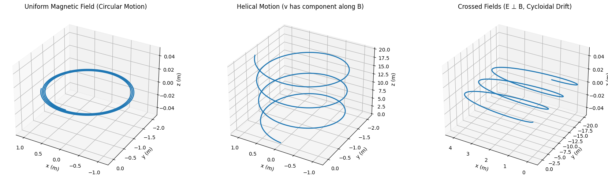

# Problem 1

# Simulating the Effects of the Lorentz Force

## 1. Exploration of Applications

The Lorentz force, given by  
$$
\vec{F} = q\vec{E} + q(\vec{v} \times \vec{B})
$$  
plays a central role in the dynamics of charged particles in electromagnetic fields. This force is foundational in various physical and technological systems:

- **Particle Accelerators**: Charged particles are accelerated and steered using electric and magnetic fields, relying on the Lorentz force to control beam paths.

- **Mass Spectrometers**: Particles are deflected by magnetic fields in a manner dependent on their charge-to-mass ratio, allowing identification of isotopes and elements.

- **Plasma Confinement (e.g., Tokamaks)**: Magnetic fields are used to confine high-energy plasma, preventing contact with containment walls and sustaining fusion reactions.

- **Cathode Ray Tubes and Electron Microscopes**: Manipulate electron beams with electromagnetic fields for display or imaging purposes.

- **Auroras and Cosmic Ray Deflection**: Earth's magnetic field influences charged particles from space, a natural demonstration of the Lorentz force.

In each case, electric fields ($\vec{E}$) are used primarily for accelerating particles, while magnetic fields ($\vec{B}$) are used for guiding or confining their motion.

---

## 2. Simulating Particle Motion

We numerically solve the motion of a charged particle using the Lorentz force law in the following scenarios:

### a. Uniform Magnetic Field (B only)

With no electric field, and an initial velocity perpendicular to $\vec{B}$, the particle undergoes **circular motion** in the plane perpendicular to $\vec{B}$ due to the magnetic force acting as a centripetal force.

### b. Combined Uniform Electric and Magnetic Fields

When both $\vec{E}$ and $\vec{B}$ are present, the trajectory depends on their relative orientation:

- **Helical motion** if $\vec{v}$ has components both parallel and perpendicular to $\vec{B}$.
- **Spiral acceleration** when $\vec{E}$ is not perpendicular to $\vec{B}$.
- **Cycloidal or drifting motion** depending on field orientations.

### c. Crossed Fields ($\vec{E} \perp \vec{B}$)

Produces a constant drift velocity:
$$
\vec{v}_{\text{drift}} = \frac{\vec{E} \times \vec{B}}{B^2}
$$

The motion becomes a **cycloidal path**: a combination of circular motion (due to $\vec{B}$) and linear drift (due to $\vec{E} \times \vec{B}$).

---

## 3. Parameter Exploration

Various physical parameters significantly affect the particle’s motion:

- **Field Strengths** ($\vec{E}$, $\vec{B}$):
  - Stronger $\vec{B}$ results in tighter circular paths (smaller Larmor radius).
  - Stronger $\vec{E}$ increases acceleration or drift speed.

- **Initial Velocity** ($\vec{v}$):
  - Determines whether motion is circular ($\vec{v} \perp \vec{B}$), helical, or more complex.

- **Charge ($q$) and Mass ($m$)**:
  - The **Larmor radius**:
    $$
    r_L = \frac{mv_\perp}{|q|B}
    $$
  - The **cyclotron frequency**:
    $$
    \omega_c = \frac{|q|B}{m}
    $$
  - Heavier or lower-charge particles have wider paths and slower rotations.

---

## 4. Visualization

Visual representations were created for different scenarios:

- **2D and 3D Plots**: Show particle trajectories in response to field configurations.
- **Circular Orbits**: Seen in uniform $\vec{B}$ fields with $\vec{v} \perp \vec{B}$.
- **Helical Paths**: When particle has a velocity component along $\vec{B}$.
- **Drift Motion**: Occurs in crossed fields; particle moves uniformly in $\vec{E} \times \vec{B}$ direction.

These plots illustrate important physical quantities:

- **Larmor Radius**: Radius of circular motion in a magnetic field.
- **Drift Velocity**: Net motion in crossed fields, independent of mass or charge sign.

---

## 5. Discussion and Real-World Relevance

This simulation illustrates foundational behavior seen in:

- **Cyclotrons**: Use circular motion in magnetic fields to accelerate particles.
- **Magnetic Bottles and Traps**: Rely on helical and mirror motion to confine plasmas.
- **Fusion Reactors**: Use magnetic fields to sustain and control high-energy plasmas.
- **Space Physics**: Helical motion and drifts explain particle behavior in Earth’s magnetosphere.

---

## 6. Suggestions for Extension

To further enhance realism and complexity:

- Introduce **non-uniform fields** (spatially varying $\vec{E}$ and $\vec{B}$).
- Model **collisions or radiation losses** in plasma simulations.
- Include **relativistic effects** for high-velocity particles.
- Simulate **multi-particle systems** to study collective effects in plasmas.
- Use **higher-order solvers** (e.g., Runge-Kutta) for improved accuracy.
---

## colab
[Motivation](https://colab.research.google.com/drive/1VIkI_qdn8nmNsVVBbYGZmh1jqoGBs9hY?usp=sharing)