# Problem 1
# Exploring the Central Limit Theorem through Simulations

## 1. Simulating Sampling Distributions

We start with three different types of populations:

- **Uniform Distribution**: All values equally likely between $0$ and $1$.

- **Exponential Distribution**: Values are mostly small but can be large (right-skewed).

- **Binomial Distribution**: Values are discrete, based on repeated yes/no trials.

For each population type, imagine we have a very large dataset (e.g., $100,000$ values). This large dataset represents the “entire population.”

## 2. Sampling and Visualization

We take random samples from each population for different sample sizes:  
$5$, $10$, $30$, and $50$.

For each sample size:

- We take $1,000$ random samples, each of the given size.

- We calculate the mean of each sample.

These $1,000$ sample means form a sampling distribution for that sample size.

We visualize the sampling distribution with a histogram.

### What We Observe:

- For small sample sizes (like $5$):  
  The sampling distribution still looks like the original population.

- As the sample size increases ($30$ or $50$):  
  The sampling distribution becomes more bell-shaped, smoother, and more normal.

This happens no matter what the original population looked like.

## 3. Parameter Exploration

### A. Effect of the Original Distribution:

- **Uniform:** Smooths out quickly into a normal shape.

- **Exponential:** Starts skewed, needs larger sample sizes to look normal.

- **Binomial:** Becomes bell-shaped when sample size increases.

### B. Effect of Sample Size:

Larger samples lead to:

- Sampling distributions that are more normal in shape.

- Less spread in sample means (they are more tightly clustered).

### C. Effect of Population Variance:

Populations with high variance produce sampling distributions that are wider.

But still: with large samples, the center becomes normally shaped.

## 4. Practical Applications of the Central Limit Theorem

- ✅ **Estimating Population Parameters:**  
  The average of a sample can be used to estimate the true population mean, $\mu$.

  Thanks to CLT, we can also estimate how much error is likely, often measured by the standard error:  
  $$ SE = \frac{\sigma}{\sqrt{n}} $$  
  where $\sigma$ is the population standard deviation and $n$ is the sample size.

- ✅ **Quality Control in Manufacturing:**  
  Factories take random samples of products.  
  The average measurement (e.g., length, weight) is used to decide if the process is working correctly.  
  If the sample mean goes too far from normal, it signals a problem.

- ✅ **Financial Predictions:**  
  CLT allows financial analysts to assume that average returns are normally distributed.  
  This is key to models for risk, portfolio design, and decision making.

## Conclusion

The Central Limit Theorem shows that, as sample size increases:

- The distribution of the sample mean becomes approximately normal.

- This is true regardless of the original population's shape.

This fundamental idea supports many real-world methods in statistics, engineering, finance, and science.

###

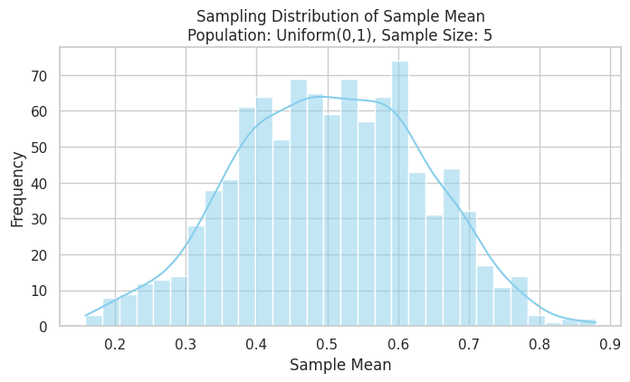

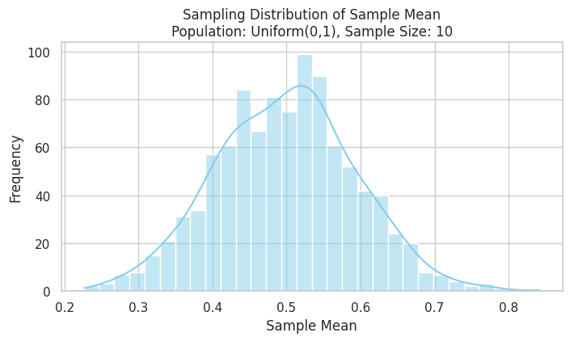

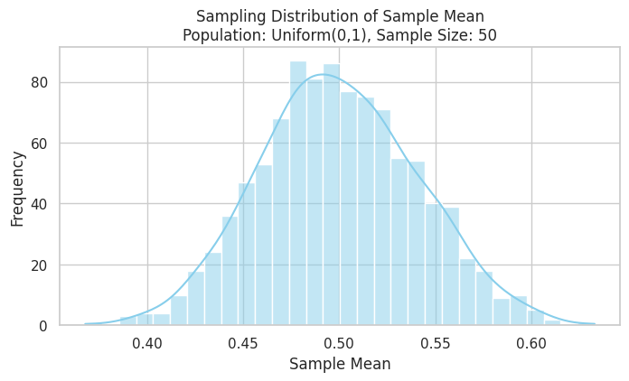

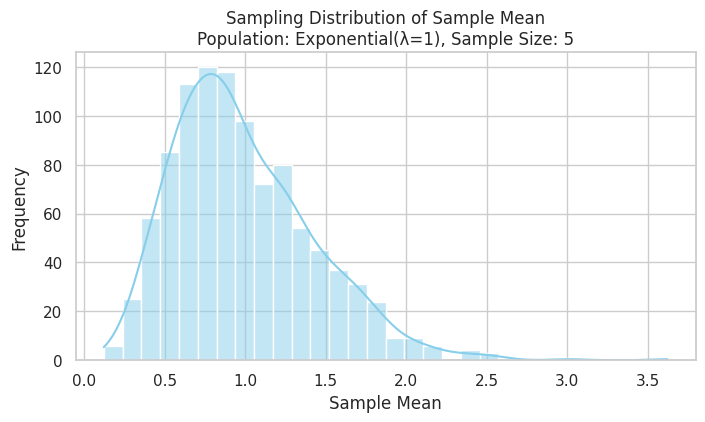

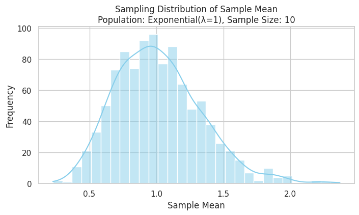

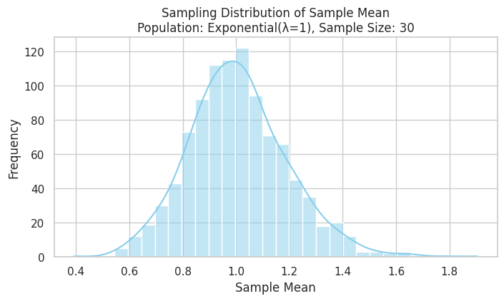

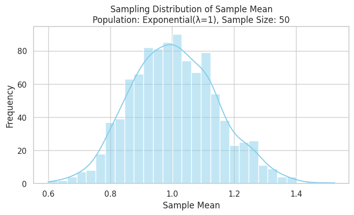

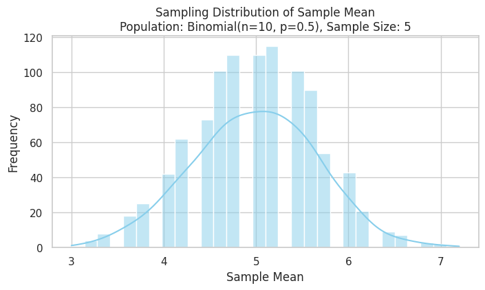

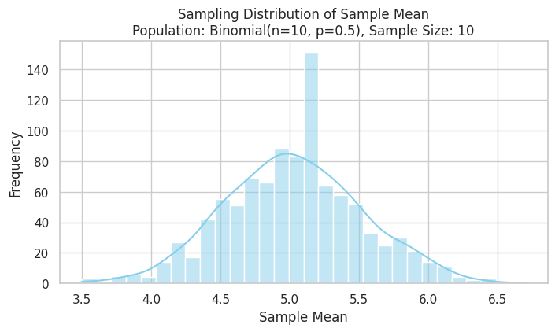

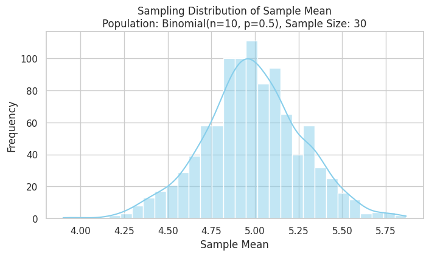

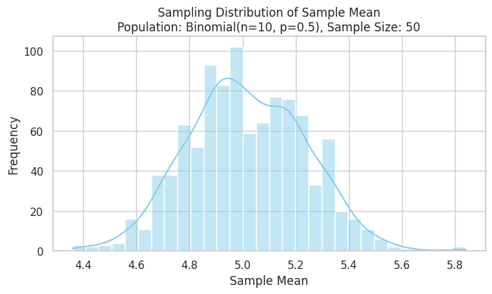

## colab
[Motivation](https://colab.research.google.com/drive/1wZHFNugAejeDTWVJ2jCXaBoaiA7BuwzQ?usp=sharing)