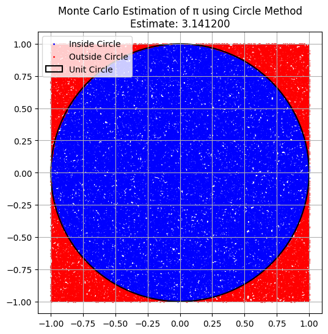
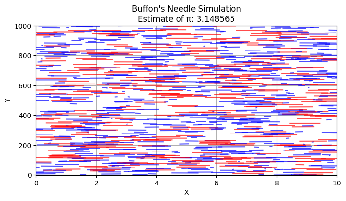

# Problem 2
# Estimating $\pi$ Using Monte Carlo Methods

## Part 1: Estimating $\pi$ Using a Circle

### 1. Theoretical Foundation

The Monte Carlo method estimates $\pi$ by simulating random points in a square that bounds a circle.

Consider a unit circle (radius = 1) inscribed in a square of side length 2 (from -1 to 1 on both $x$ and $y$ axes).

The area of the circle is:

\[
\pi r^2 = \pi, \quad \text{since } r = 1
\]

The area of the square is:

\[
2 \times 2 = 4
\]

If we randomly generate a large number of points uniformly within the square, the fraction of points that fall inside the circle should be approximately equal to the ratio of the areas:

\[
\frac{\text{Points inside the circle}}{\text{Total points}} \approx \frac{\pi}{4}
\]

So, we can estimate $\pi$ as:

\[
\pi \approx 4 \times \left( \frac{\text{Points inside the circle}}{\text{Total points}} \right)
\]

### 2. Simulation

- Randomly generate a large number of points $(x, y)$ within the square.
- Count how many points satisfy $x^2 + y^2 \leq 1$, which means they lie within the unit circle.
- Use the ratio above to estimate $\pi$.

### 3. Visualization

- Plot all points:
  - Points inside the circle are marked in one color (e.g., blue).
  - Points outside the circle are marked in another color (e.g., red).
- Show the boundary of the unit circle for visual comparison.

### 4. Analysis

- As the number of points increases, the estimate becomes more accurate.
- The convergence follows the **Law of Large Numbers**.
- However, the rate of convergence is slow; to get more decimal places of accuracy, a very large number of points is needed.
- Computationally, this method is simple and parallelizable, but not very efficient for high precision.

---

## Part 2: Estimating $\pi$ Using Buffon’s Needle

### 1. Theoretical Foundation

Buffon’s Needle is a probability problem where a needle of length $l$ is dropped onto a floor with parallel lines spaced $t$ units apart (usually $l \leq t$).

The probability $P$ that the needle will cross one of the lines is:

\[
P = \frac{2l}{t\pi}
\]

Rearranging to solve for $\pi$ gives the estimation formula:

\[
\pi \approx \frac{2lN}{tC}
\]

Where:

- $N$: number of needle drops  
- $C$: number of times the needle crosses a line

### 2. Simulation

- Simulate many random needle drops.
- For each drop, randomly choose:
  - The distance from the needle’s center to the nearest line.
  - The angle between the needle and the lines.
- Count how often the needle crosses a line.
- Use the formula above to estimate $\pi$.

### 3. Visualization

- Draw the parallel lines on the plane.
- Show each needle's position and orientation.
- Mark crossing needles in one color.
- Mark non-crossing needles in another.
- Visual representation helps understand the geometric conditions for a crossing.

### 4. Analysis

- Like the circle method, the accuracy improves with more throws.
- However, this method can be less stable if there are few crossings, especially for small numbers of throws.
- The convergence is slower compared to the circle method unless optimized.
- It's a more complex simulation due to angle and geometry, but offers a unique probabilistic view of $\pi$.

---

## Final Comparison

| Feature        | Circle Method             | Buffon's Needle                         |
|----------------|---------------------------|------------------------------------------|
| Simplicity     | Simple to implement        | More complex geometry                    |
| Visualization  | Clear and intuitive        | More abstract, but interesting           |
| Convergence Speed | Moderate               | Slower and less stable                   |
| Accuracy       | Good with enough points    | Sensitive to rare events (crossings)     |
| Use Cases      | Good general purpose estimator | Great example of geometry and probability |

---

## Conclusion

Both Monte Carlo approaches provide insightful and educational ways to estimate $\pi$:

- The circle-based method is better for straightforward estimation and visualization.
- Buffon’s Needle is conceptually fascinating, linking randomness, geometry, and $\pi$ in a clever way.

Despite their limitations, both methods show how randomness can solve problems in mathematics and science through simulation.

###

## colab
[Motivation](https://colab.research.google.com/drive/1jQlQatUul_om4qU-6c4-ZIBdhJ4GcYBj?usp=sharing)